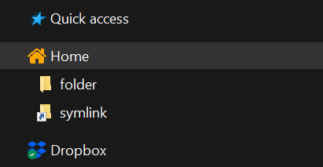

# Custom Windows Explorer Top Level Icon tool

This tool allows to create a custom top-level element in the Navigation pane of Windows Explorer, similar to how Dropbox and OneDrive appear.
The created element links to a specific directory and can be assigned a custom icon.



Example of a custom item with a custom icon in the Windows 10 Explorer. Sort order is `2`, which makes it appear below Quick Access.

Please use this tool at your own risk, as this is using poorly documented registry entries that might affect your system.
PRs are welcome, as this might not be the optimal way of doing it! (Also I never used Powershell before!)

# Usage

This script needs to be run with admin rights.

```powershell
# Usage:
> .\topLevelIcon.ps1 -Add -Clsid <GUID> -Name <Name> -Path <Path> [-IconPath <iconPath>] [-SortOrder <SortOrder>] [-InfoTip <InfoTip>]
```

```powershell
> .\topLevelIcon.ps1 -Remove -Clsid <GUID> 
```

## Arguments

- `-Add`: Use this flag for creating an entry
- `-Remove`: Use this flag for removing an entry. When removing, only `Clsid` is required.
- `-Clsid`: GUID including brackets
- `-Name`: Name which will be displayed in the Explorer panel
- `-Path`: Path to folder. ExpandString, so it can include variables like `%USERPROFILE%`
- `-IconPath`: Path to custom icon. ExpandString, so it can include variables like `%USERPROFILE%` (optional)
- `-SortOrder`: Sort order for this icon, will determine placement in the navigation pane (optional)
- `-InfoTip`: Custom tooltip. Windows 10 and 11 don't seem to show tooltips on Explorer Panel icons, so probably not needed. (optional)

## Creating an entry

When creating a new entry, it is recommended to provide a GUID. If you don't provide one, a GUID will automatically be generated. Make sure to note this GUID down so you can find the registry entries in the future.

```powershell
> .\topLevelIcon.ps1 -Add -Clsid "{923BF74F-8635-4BAB-AD1E-2BA6A992DEA2}" -Name "My custom folder" -Path "C:\path\to\your\folder" -IconPath "C:\path\to\your\icon.ico" -SortOrder 2 -InfoTip "My custom tooltip"
```

## Removing an entry

```powershell
> .\topLevelIcon.ps1 -Remove -Clsid "{923BF74F-8635-4BAB-AD1E-2BA6A992DEA2}"
```

# What this tool does

This tool creates a new class in `HKCU:\Software\Classes\CLSID\` and populates it with the required keys for name, path, type, icon, attributes, etc. (`HKCU:\Software\Classes\Wow6432Node\CLSID\` for 32-bit compatibility is omitted. If someone needs this, please submit a PR) 

It also creates an entry in `HKCU:\Software\Microsoft\Windows\CurrentVersion\Explorer\HideDesktopIcons\NewStartPanel\` to hide the icon from the desktop, as well as in `HKLM:\SOFTWARE\Microsoft\Windows\CurrentVersion\Explorer\Desktop\NameSpace\` to register the class.
